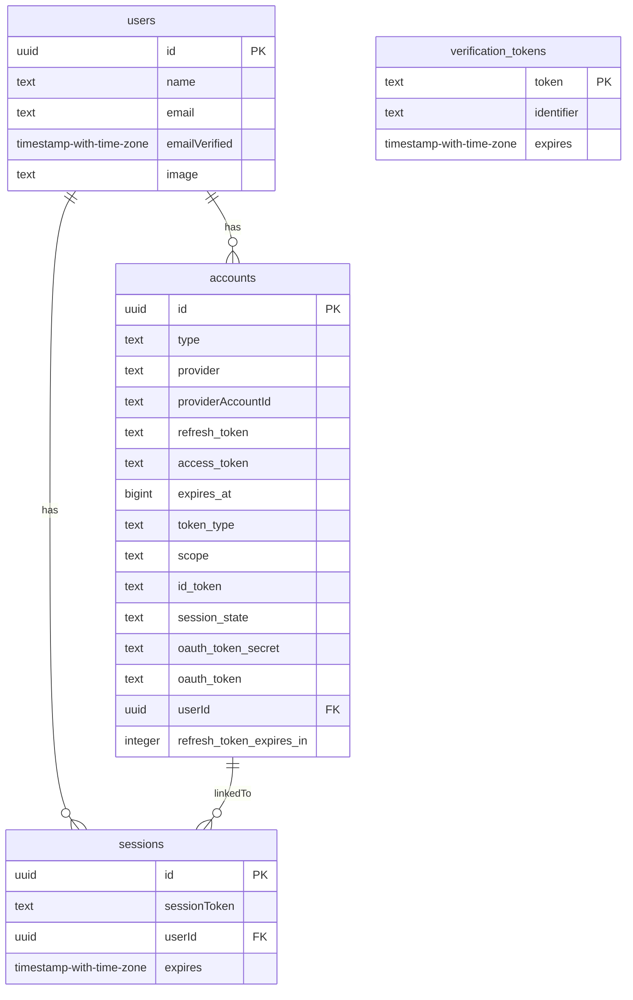

# Database

The database for NeuchatechBase will implement the base tables for user management.
It uses Hasura and Postgres.

## Database graph

```mermaid
erDiagram
    accounts {
        uuid id PK
        text type
        text provider
        text providerAccountId
        text refresh_token
        text access_token
        bigint expires_at
        text token_type
        text scope
        text id_token
        text session_state
        text oauth_token_secret
        text oauth_token
        uuid userId FK
        integer refresh_token_expires_in
    }

    sessions {
        uuid id PK
        text sessionToken
        uuid userId FK
        timestamp-with-time-zone expires
    }

    users {
        uuid id PK
        text name
        text email
        timestamp-with-time-zone emailVerified
        text image
    }

    verification_tokens {
        text token PK
        text identifier
        timestamp-with-time-zone expires
    }

    users ||--o{ accounts : "has"
    users ||--o{ sessions : "has"
    accounts ||--o{ sessions : "linkedTo"

```
